# Customer Support Ticket Analytics System

An end-to-end analytics pipeline built on a 200,000-row customer support ticket dataset (2022–2024), covering data cleaning, NLP-based ticket classification, response/resolution time analytics, and a 4-page executive dashboard.

> **Note on images:** all chart/dashboard screenshots below reference the `images/` folder already in this repo, using the same filenames as uploaded.

---

## Objective

Customer support teams generate large volumes of ticket data but often lack a structured way to turn it into decisions. This project builds a full analytics system to:

- Clean and standardize raw ticket data for downstream analysis
- Apply NLP to classify tickets into categories and score resolution sentiment
- Quantify response time, resolution time, and SLA performance across every operational dimension (priority, channel, category, region, subscription tier, complexity)
- Identify drivers of escalation and SLA breach
- Package findings into an executive-ready, multi-page dashboard

**Outcome target:** surface actionable levers to improve support efficiency and reduce ticket resolution time.

---

## Project Structure

| # | Notebook | Output |
|---|----------|--------|
| 1 | `1. Data cleaning.ipynb` | `Clean_Dataset.csv` |
| 2 | `2. Text Analysis nlp.ipynb` | `NLP_enriched_tickets.csv` (ticket classification, sentiment scoring) |
| 3 | `3. Response Time Analytics.ipynb` | `response_time_enriched.csv` (correlation, SLA, trend analysis) |
| 4 | `4. Support Dashboard.ipynb` | 4-page interactive dashboard |

**Stack:** Python (pandas, numpy, scikit-learn), NLTK/TF-IDF for NLP, matplotlib/seaborn/Plotly for visualization.

---

## Analysis

### 1. Data Cleaning
Raw ticket data (72 MB) was standardized and validated into a clean 200,000-row base dataset spanning January 2022 to December 2024, ready for feature engineering and modeling.

### 2. Text Analytics & NLP — Ticket Classification
Tickets were classified into 10 categories (Login Issue, Bug Report, Refund Request, Security Concern, etc.) and scored for resolution sentiment using NLP.

- **Resolution sentiment** is mildly positive and nearly identical across all categories (0.399–0.406), indicating support-closing language is consistent regardless of issue type.
- **Classification performance is weak.** The confusion matrix shows heavy misclassification across most categories, and two categories (*Data Sync Issue*, *Payment Problem*) are **never predicted at all** — every ticket that should map to them is routed elsewhere. This points to overlapping/insufficiently distinct text features between categories rather than a data volume problem, and is flagged as a priority fix (see Conclusion).

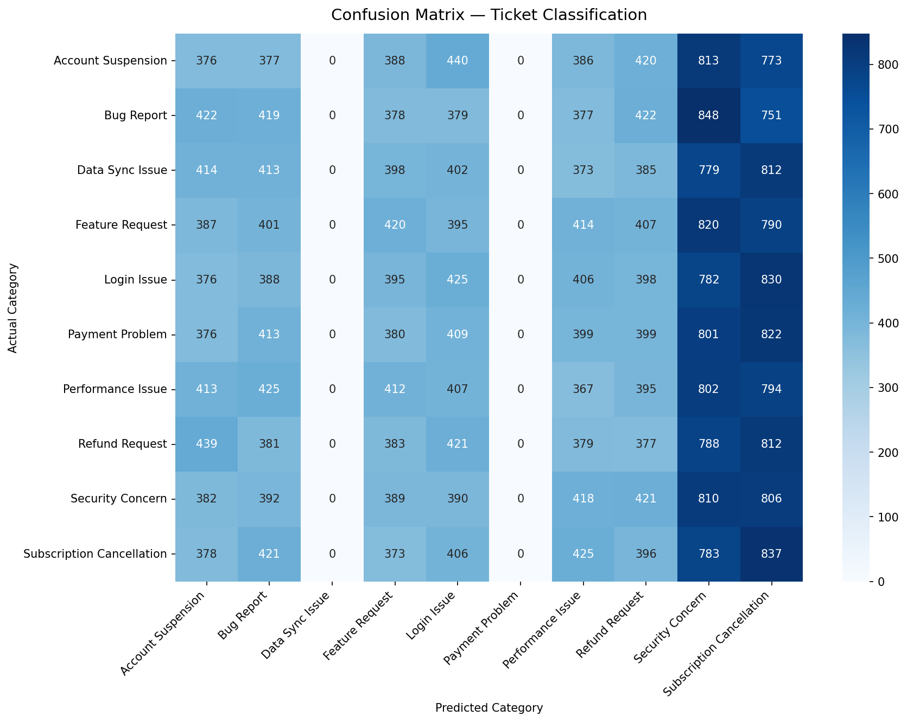

### 3. Response Time Analytics
This notebook tested for relationships between first response time, resolution time, SLA breach, and 10+ operational and customer attributes.

- **Correlations are effectively zero.** No feature (customer tenure, issue complexity, prior tickets, satisfaction, etc.) shows more than a ±0.01 Pearson correlation with resolution time.

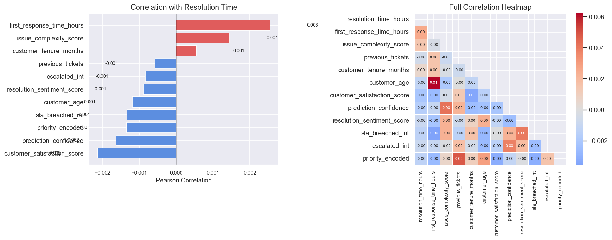

- **No day-of-week effect.** Ticket volume (~28,500/day) and average first response time (~36.3h) are flat across all seven days.

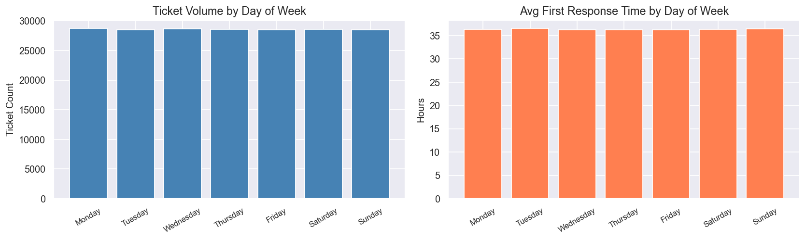

- **No monthly seasonality.** Volume holds steady at 5,000–5,800 tickets/month for the full three-year window with no trend or cyclicality.

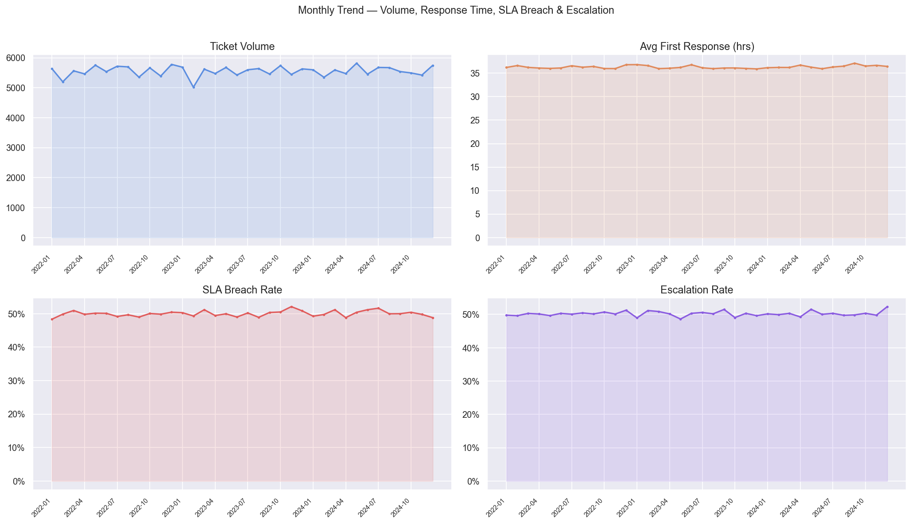

- **First response time and resolution time are uncorrelated** — the scatter plot shows uniform noise with no diagonal pattern.

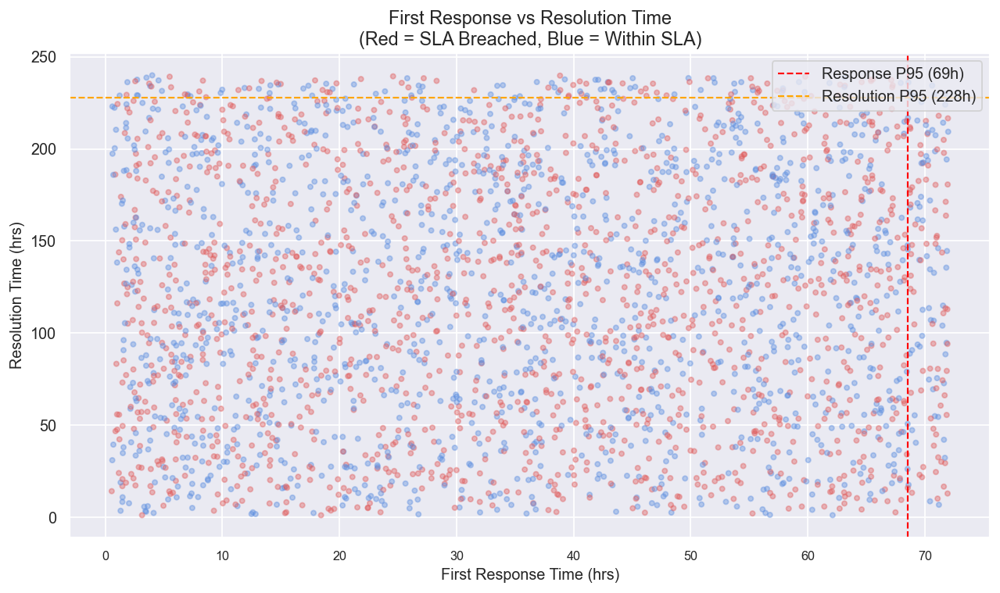

- **SLA breach rate is ~50% everywhere** — by priority, channel, category, region, subscription tier, and complexity, breach rate never moves outside a 49.5–50.8% band.

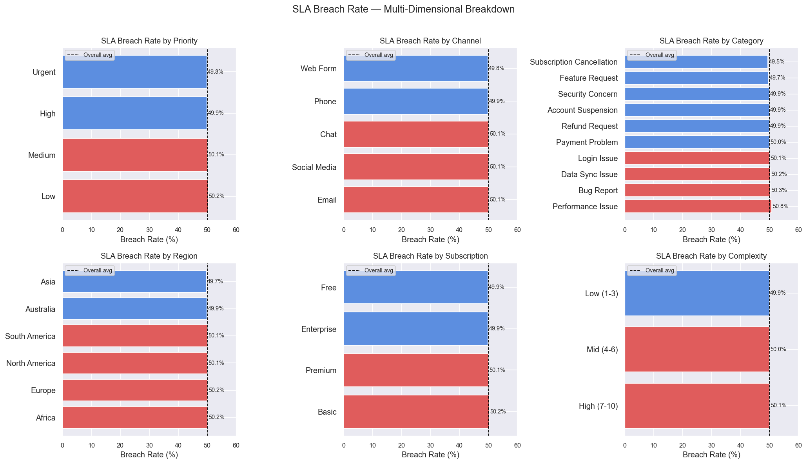

- **Escalation rate mirrors the same pattern** — hovering at ~50% regardless of category, with resolution time for escalated vs. non-escalated tickets nearly identical across priority levels.

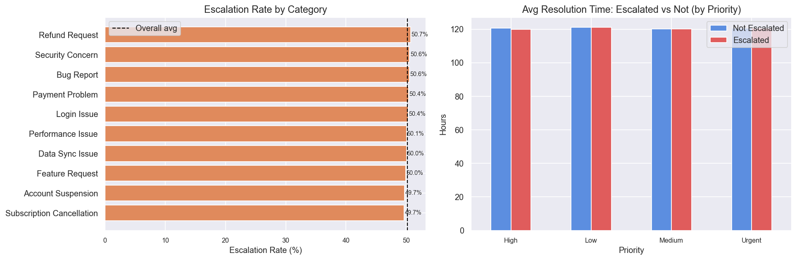

- **Response speed doesn't meaningfully change outcomes.** Even "Immediate (<1h)" responses show a 48.2% breach rate, barely below "Delayed (>24h)" tickets at 49.9% — and satisfaction stays pinned at ~3.00/5 in every bucket.

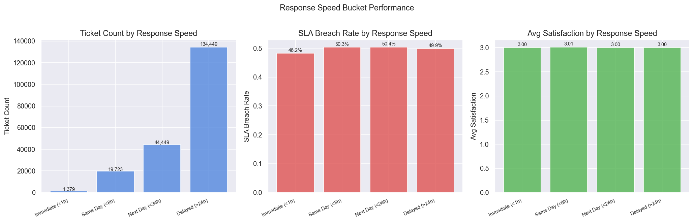

- **Response and resolution time distributions are uniform**, not the right-skewed pattern typical of real-world ticket data — mean and median are identical in both cases (36.3h / 120.5h), which is a strong signal of the underlying data being uniformly random rather than reflecting real operational drivers.

### 4. Support Dashboard (4 pages)
- **Page 1 – Overview:** 200,000 tickets, 50.0% SLA breach rate, 50.2% escalation rate, 36.3h avg first response, 120.5h (5.0 days) avg resolution, 3.00/5 satisfaction. Status, priority, and risk categories are near-evenly distributed.

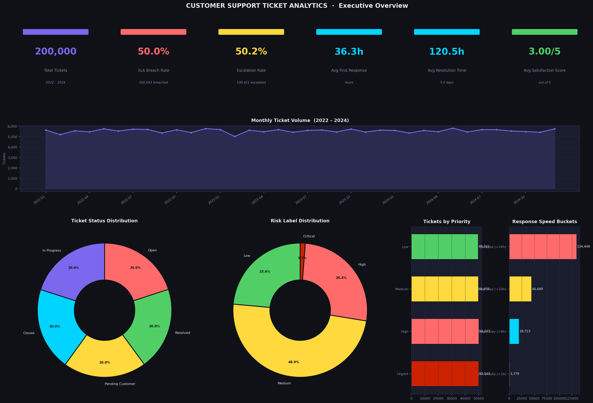

- **Page 2 – SLA & Response Time:** Confirms breach rate and response time are flat across every segmentation cut — no single lever (channel, region, subscription) stands out as a fix point.

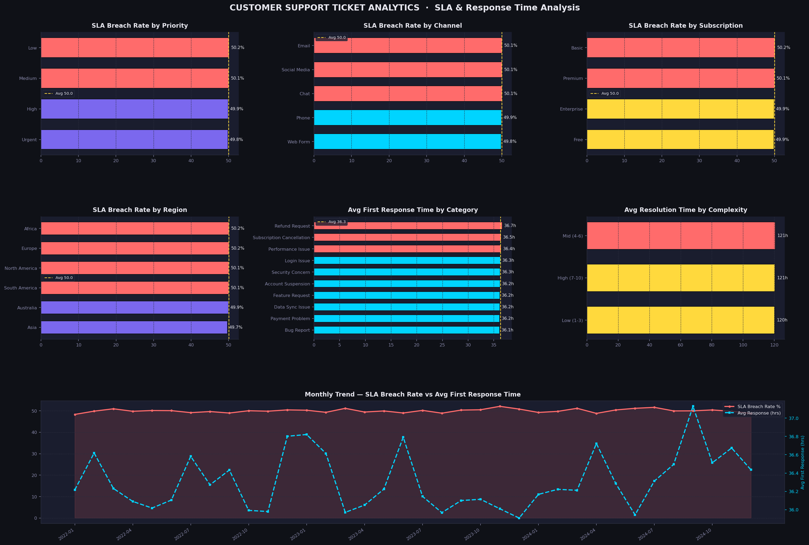

- **Page 3 – Escalation & Risk:** Escalation rate (~50%) and satisfaction score (~3.0) are statistically indistinguishable across Low/Medium/High/Critical risk labels — risk labels are not currently predictive of outcomes.

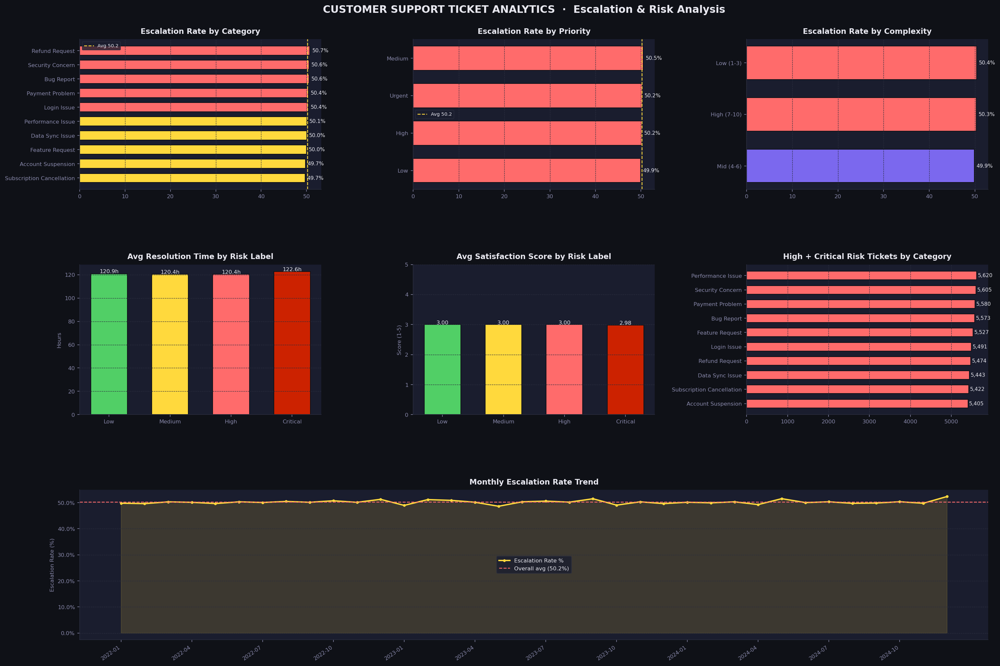

- **Page 4 – Category & Channel:** All 5 channels (Chat, Email, Phone, Social Media, Web Form) perform near-identically on every metric (~40K tickets, ~36.3h response, ~120.5h resolution, ~50% breach, ~3.00 satisfaction).

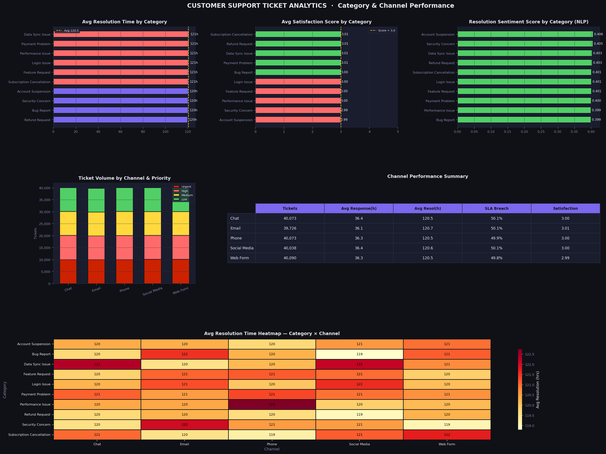

---

## Conclusion

The pipeline successfully delivers a complete, production-style analytics workflow — cleaning, NLP enrichment, statistical analysis, and executive dashboarding — on a 200K-ticket dataset.

The core analytical finding, however, is that **the dataset shows no meaningful relationships between any operational attribute and outcomes** (response time, resolution time, SLA breach, escalation, satisfaction). Every cut of the data — by priority, channel, category, region, complexity, or risk label — converges to roughly the same value (SLA breach ~50%, satisfaction ~3.0, resolution ~120h), and both time distributions are uniform rather than realistically skewed. This pattern is consistent with **synthetically generated data without embedded business logic**, rather than a real support operation.

**Key takeaways for the portfolio narrative:**
- The analysis pipeline and dashboard are fully functional and would surface real drivers immediately if run on operational data with genuine signal.
- Correctly identifying "no signal present" — instead of overfitting a narrative to noise — is itself the right analytical outcome here, and is called out explicitly rather than glossed over.
- The one genuine model weakness worth fixing is the ticket classifier's failure to predict two categories at all; next step would be revisiting the feature set (e.g., richer TF-IDF n-grams or embeddings) and checking class balance.

**Suggested next steps:** re-run the same pipeline against a real or more realistically-simulated ticket dataset (with actual noise/skew and embedded relationships) to validate that the analytics and dashboard correctly surface true drivers of SLA breach and escalation.

**NOTE** --> The datasets were too lare to push through so they have been placed on gitignore

## 🤝 Let's Connect!

Whether you want to discuss the SQL scripts in this repo, talk about remote work trends, or just say hi—my inbox is open!

* 💼 **LinkedIn:** [Connect with me on LinkedIn](https://www.linkedin.com/in/tarun-panigrahi-523534325)
* 🐙 **GitHub:** [Follow my latest projects](https://github.com/tarun259952)
* 📧 **Gmail:** [Send me an email](mailto:tarunpanigrahi259@gmail.com)
